<div align="center">

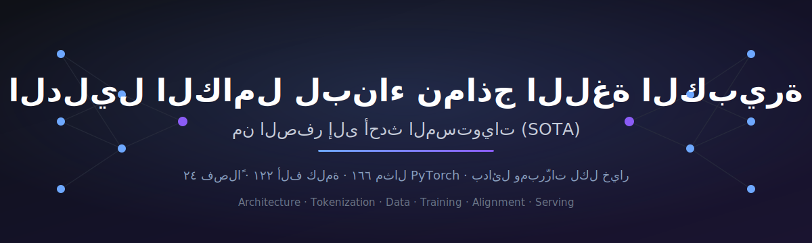

# الدليل الكامل لبناء نماذج اللغة الكبيرة من الصفر إلى أحدث المستويات (SOTA)

**كورس عربي تفاعلي شامل — من البداية للنهاية — لبناء نماذج اللغة الكبيرة (LLMs):**
المعمارية · الترميز · هندسة البيانات · التدريب · المُحسِّنات · التدريب الموزّع · المحاذاة · الاستدلال والنشر.

لكل مفهوم: **حدس مبسّط ← شرح تقني ← مثال كود PyTorch ← البدائل ← لماذا الخيار الموصى به أفضل.**


### ▶️ **[افتح التطبيق التفاعلي مباشرة (GitHub Pages)](https://maljefairi.github.io/arabic-llm-course/)**

</div>

---

## ما هذا؟

هذا ليس ملخّصًا سطحيًا، بل **كتاب/كورس متكامل (~122 ألف كلمة، 166 مثال كود)** يعلّمك كيف تُبنى نماذج اللغة الحديثة فعليًا — كما تفعل المختبرات الرائدة (Qwen3، DeepSeek-V3، OLMo 3، Nemotron، Llama). يبدأ من الصفر للمبتدئين، ويتدرّج حتى أحدث الوصفات (Muon، MLA، MoE، التلدين، GRPO/RLVR).

المحتوى متوفّر بصيغتين:
- 🌐 **تطبيق HTML تفاعلي** (`index.html`): فهرس جانبي قابل للبحث، كود ملوّن، تصميم عربي RTL. — **[جرّبه مباشرة هنا](https://maljefairi.github.io/arabic-llm-course/)**
- 📄 **كتاب Markdown واحد** (`الدليل_الشامل_لبناء_نماذج_اللغة.md`): للقراءة أو التحويل إلى PDF/Word.

## ✨ ميزات التطبيق التفاعلي

| الميزة | الوصف | التكلفة |
|---|---|---|
| 🔊 **قارئ آلي للأقسام** | يقرأ كل قسم بصوت مسموع عبر Web Speech API المدمج (يدعم الأصوات العربية مثل *Majed*) — مع تحكّم بالسرعة والإيقاف وتمييز الفقرة المقروءة | مجاني بالكامل — لا توكنز ولا استضافة |
| 📝 **ملاحظات وأسئلة** | دوّن ملاحظاتك وأسئلتك لكل قسم؛ تُحفظ تلقائيًا في متصفحك (localStorage)، مع تصدير/استيراد JSON | مجاني — خاص بك، بلا خادم |
| 🖼️ **صور توضيحية** | 13 رسمًا (SVG) مدمجة بين الأقسام تشرح المعمارية، الانتباه، MoE، خط البيانات، المحاذاة، والاستدلال | — |
| 📖 **شرح المصطلحات تلقائيًا** | أول ما يظهر مصطلح (T5، DeepSeek، Mistral…) يُشرح أسفل الفقرة مباشرة، مع مسرد كامل قابل للبحث | — |
| 📍 **حفظ مكان القراءة** | يتذكّر أين توقّفت ويعرض زر «تابع من حيث وقفت»، مع شريط تقدّم (أكملت N/24) | مجاني — محليًا |
| 🔡 **تحكّم بحجم الخط + اختصارات** | تكبير/تصغير الخط، والتنقّل بين الفصول بمفاتيح ← → | — |
| ⏱️ **زمن قراءة + صناديق تنبيه** | تقدير زمن القراءة لكل قسم، وتمييز بصري لصناديق «الخلاصة» و«التمرين» | — |

> 🔒 الملاحظات تُخزَّن محليًا في متصفحك فقط (لا تُرفع لأي خادم). استخدم زر **التصدير** لأخذ نسخة احتياطية أو نقلها لجهاز آخر.

---

## دورة حياة البناء الكاملة

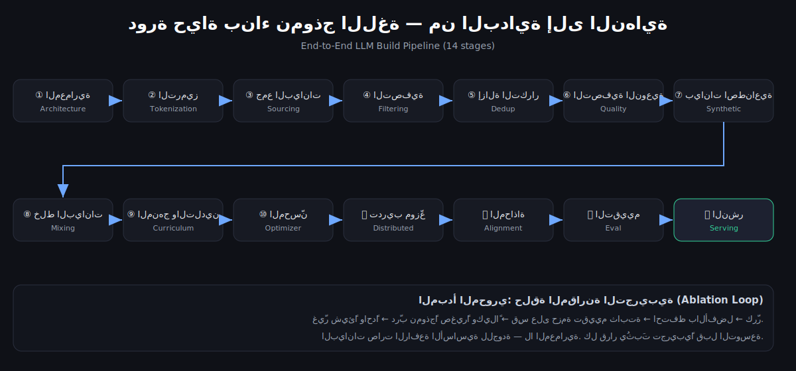

> **المبدأ المحوري:** البيانات صارت الرافعة الأساسية للجودة — لا المعمارية. كل قرار يُثبَت بـ«حلقة المقارنة التجريبية» (ablation loop): غيّر شيئًا واحدًا، درّب نموذجًا صغيرًا، قِس، احتفظ بالأفضل.

---

## فهرس الفصول

| # | الفصل | يغطّي |
|:-:|---|---|
| 0 | مقدمة وخارطة الطريق | الصورة الكبرى، pretraining مقابل fine-tuning، تعريف الحجم المتوسط |
| 1 | أساسيات الشبكات العصبية | backprop، cross-entropy، embeddings، حلقة التدريب |
| 2 | الانتباه والمُحوِّل من الصفر | self-attention، multi-head، causal mask، بناء GPT مصغّر |
| 3 | المعمارية الحديثة | RoPE، RMSNorm، SwiGLU، Pre-Norm، tied embeddings |
| 4 | كفاءة الانتباه | MHA → MQA → GQA → **MLA**، KV cache، FlashAttention |
| 5 | خليط الخبراء MoE | fine-grained + shared experts، auxiliary-loss-free balancing |
| 6 | الانتباه الهجين + MTP | sliding window، Mamba-2، Multi-Token Prediction |
| 7 | استقرار التدريب | QK-norm، z-loss، gradient clipping، منع loss spikes |
| 8 | الترميز Tokenization | BPE/BBPE، قانون حجم المفردات، تدريب مُرمِّز |
| 9 | البيانات (1): المصادر | Common Crawl، WARC vs WET، الاستخراج، الرخص |
| 10 | البيانات (2): التصفية | قواعد C4/Gopher، مرشّحات التكرار |
| 11 | البيانات (3): إزالة التكرار | MinHash/LSH، Bloom، SemDeDup، D4 |
| 12 | البيانات (4): التصفية النوعية | مصنّف fastText (DCLM)، FineWeb-Edu، الـ Data-Quality Illusion |
| 13 | البيانات (5): الاصطناعية | WRAP، Nemotron-CC، Phi/Cosmopedia، ProX/RefineX، model collapse |
| 14 | الكود والرياضيات وتعدّد اللغات | The Stack، StarCoder، OpenWebMath، DeepSeekMath |
| 15 | خلط البيانات | DoReMi، RegMix، Data Mixing Laws |
| 16 | المنهج والتلدين | mid-training، annealing، WSD، فخ انحلال LR |
| 17 | إزالة التلوث والتقييم | n-gram 13، embedding، lighteval، حزم المقارنة |
| 18 | المُحسِّنات وقوانين القياس | AdamW، **Muon**، μP، FP8، Chinchilla، data-constrained |
| 19 | التدريب الموزّع | DP/TP/PP/EP، ZeRO/FSDP، Megatron، gradient checkpointing |
| 20 | المحاذاة وما بعد التدريب | SFT، RLHF، **DPO**، **GRPO**، RLVR، الاستدلال الطويل |
| 21 | الاستدلال والنشر | KV cache، PagedAttention/vLLM، speculative decoding، التكميم |
| 22 | المخطط الكامل بالأرقام | معمارية + ميزانية رموز + خلطة بيانات + قائمة تحقّق (14 خطوة) |
| 23 | المرجع الشامل | جدول مجموعات البيانات + الأوراق + المسرد العربي-الإنجليزي |

---

## لمحات من المحتوى المرئي

### كتلة المُحوِّل الحديثة
<div align="center">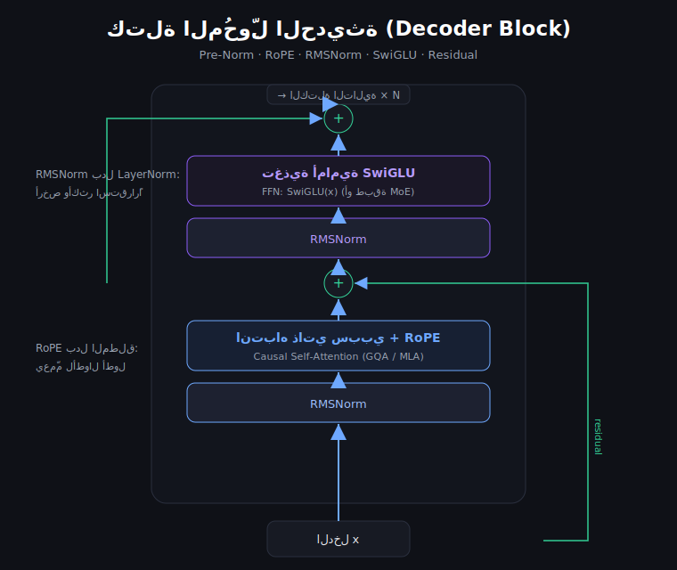</div>

### تطوّر آليات الانتباه (وكفاءة الذاكرة)
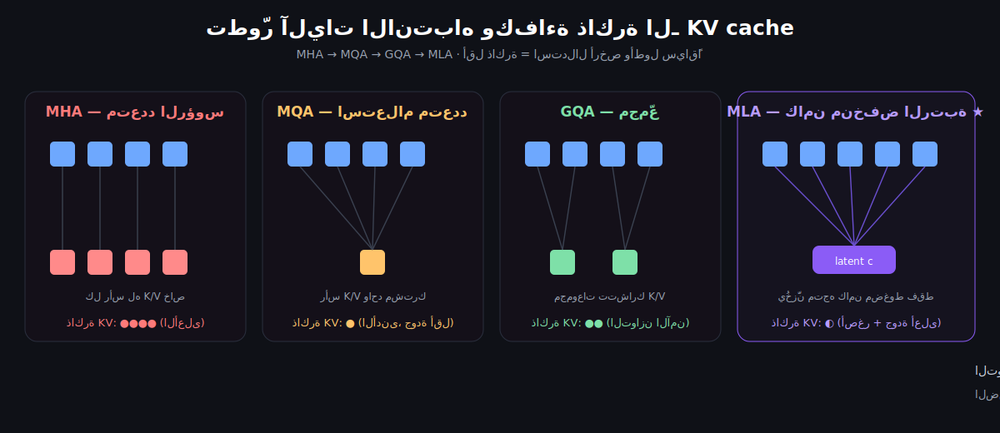

### خليط الخبراء (MoE)
<div align="center">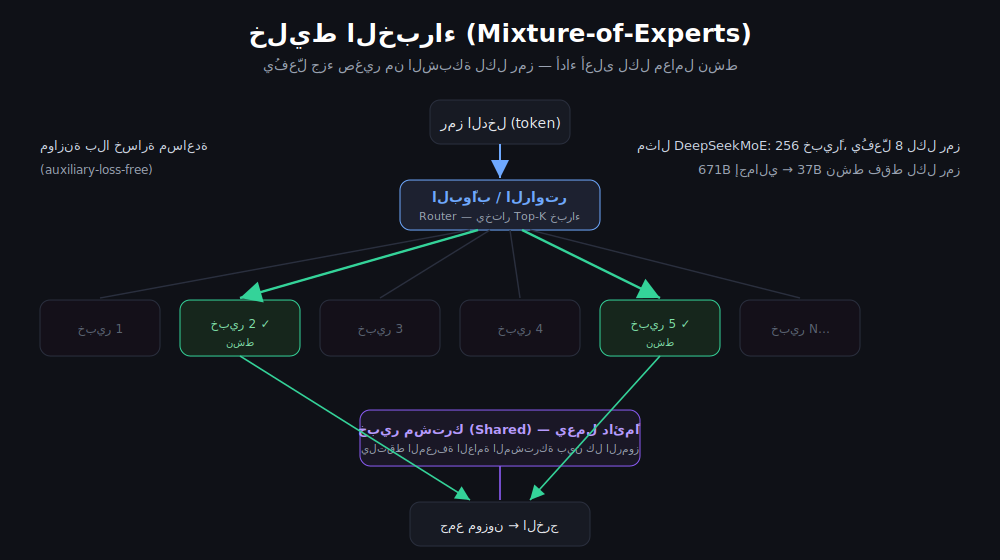</div>

### المنهج المرحلي والتلدين (حيث يُبنى التخصّص)
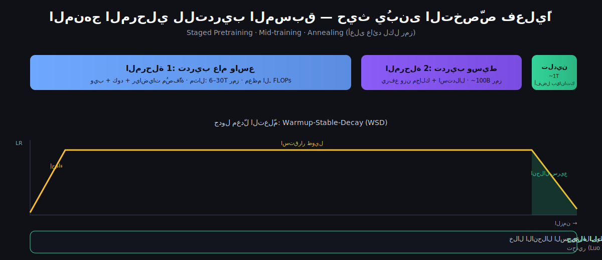

### الترميز بأزواج البايت (BPE)
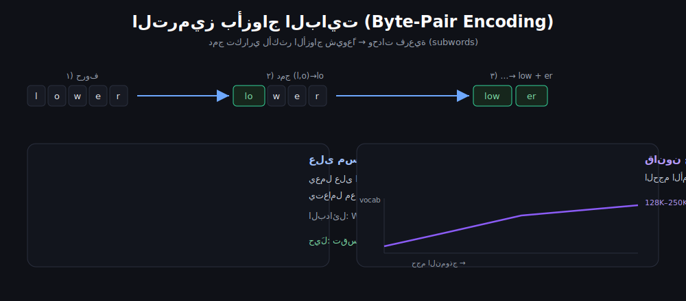

### إزالة التكرار: MinHash + LSH
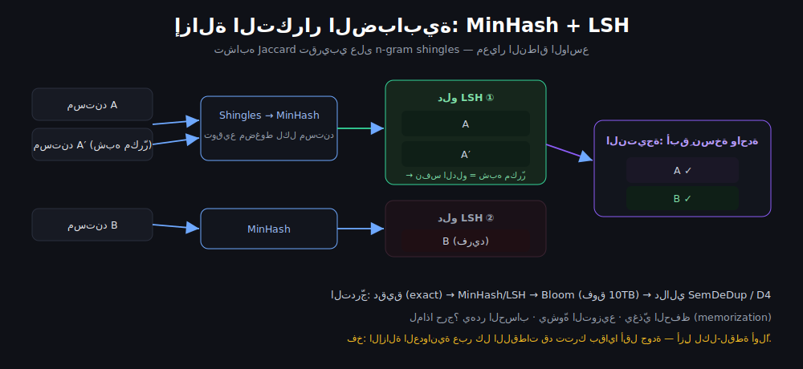

### قمع التصفية النوعية
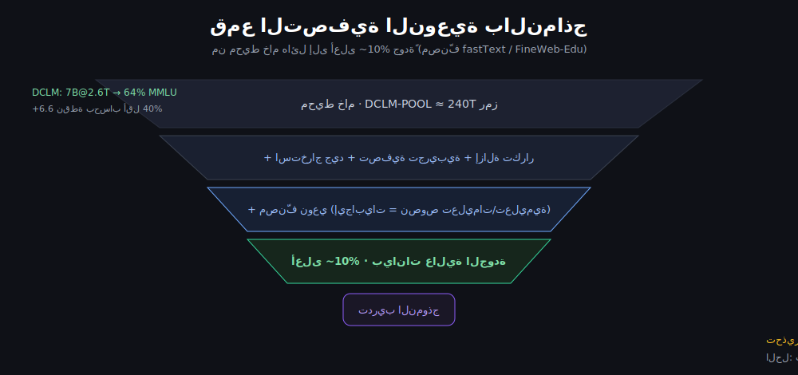

### المحسّن: Muon مقابل AdamW (~2× كفاءة)
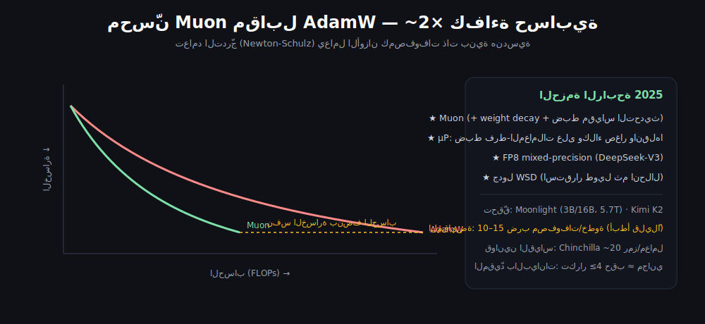

### التدريب الموزّع (DP / FSDP / TP / PP)
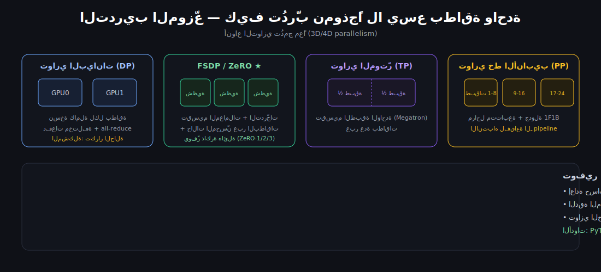

### مسار المحاذاة (SFT → DPO/GRPO/RLVR)
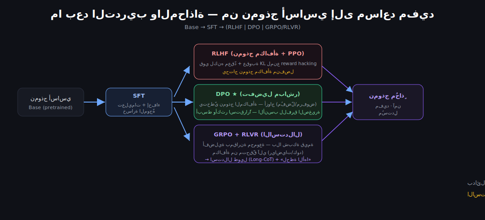

### الاستدلال والنشر
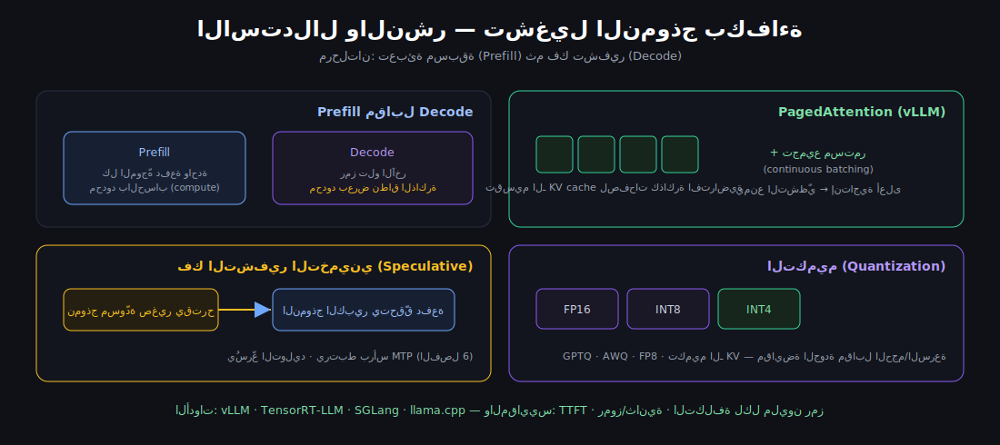

---

## كيف تستخدمه

**الطريقة الأسهل — مباشرة على الإنترنت:**
افتح **[التطبيق التفاعلي](https://maljefairi.github.io/arabic-llm-course/)**.

**محليًا — خادم بسيط:**
```bash
git clone https://github.com/maljefairi/arabic-llm-course.git
cd arabic-llm-course
python3 -m http.server 8077
# ثم افتح: http://127.0.0.1:8077/index.html
```

**أو افتح الملف مباشرة:** انقر نقرًا مزدوجًا على `index.html` (يحتاج اتصال إنترنت لتلوين الكود والخطوط فقط؛ وإن انقطع يعرض المحتوى نصيًا).

---

## بنية المستودع

```
.
├── index.html                              # التطبيق التفاعلي (RTL، بحث، كود ملوّن)
├── الدليل_الشامل_لبناء_نماذج_اللغة.md        # الكتاب الكامل في ملف واحد
├── sections/                               # الفصول الـ24 (مصدر التحرير، ملف لكل فصل)
│   ├── 00-introduction.md … 23-reference-datasets-glossary.md
├── images/                                 # الرسوم التوضيحية (SVG)
├── assemble.py                             # يُعيد توليد الكتاب + index.html من sections/
└── README.md
```

**للتعديل أو التوسعة:** عدّل/أضف ملفًا في `sections/`، ثم:
```bash
python3 assemble.py     # يُعيد بناء الكتاب الموحّد و index.html
```

---

## النماذج والمصادر التي يستند إليها الكورس

يُقطّر الكورس الوصفات المفتوحة والأبحاث الحديثة (حتى أوائل 2026)، أبرزها:
**OLMo 3** (أكثرها انفتاحًا end-to-end) · **Qwen3** (منهج البيانات على مستوى المثيل) · **DeepSeek-V3** (MLA، MoE، MTP، FP8) · **Nemotron** (البيانات الاصطناعية والمعمارية الهجينة) · **Moonlight/Kimi** (Muon) · ومجموعات بيانات **FineWeb/FineWeb-Edu، DCLM، Dolma، The Stack، OpenWebMath** (انظر الفصل 23 للمرجع الكامل بمعرّفات arXiv).

> ⚠️ **ملاحظة:** المجال يتغيّر شهريًا، وبعض «القوانين» قيد المراجعة المستمرة. اعتبر هذا خريطة للمبادئ الدائمة، وثِق بتجارب المقارنة الخاصة بك فوق أي افتراضات.

---

## الرخصة — وقفٌ لوجه الله تعالى

هذا الكورس **وقفٌ لوجه الله تعالى**، متاحٌ للجميع مجانًا (انظر [LICENSE](LICENSE)).

**ما معنى الوقف؟** الوقف هو حبس الأصل وتسبيل المنفعة — أي أن العمل يبقى مِلكًا عامًا لا يُحتكر، ومنفعته مبذولة للناس كافّةً بلا مقابل. لك أن تستخدمه وتنسخه وتوزّعه وتعدّله وتبني عليه لأي غرض دون إذنٍ أو رسوم. نرجو فقط أن تُبقي إشارة كونه وقفًا عند إعادة نشره، وأن تذكر مَن أعدّه بدعوةٍ صالحة. ومن انتفع به فأجره عند الله.

<div align="center">

صُنع بشغف لتعليم بناء نماذج اللغة بالعربية · إن نفعك فابدأ بنجمة ⭐

</div>
